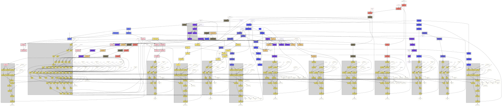

# descent_unet_example

Minimum example of trying to build a UNet with https://github.com/sjb3d/descent

The following changes were made to descent (my branch is at https://github.com/apexys/descent):

- Added an upsampling method https://github.com/apexys/descent/blob/main/src/array.rs#L833
- Added a cropping method https://github.com/apexys/descent/blob/main/src/array.rs#L850
- Added logging of the graph during the optimization steps (see https://github.com/apexys/descent/blob/main/src/graph.rs#L110 and following). This only works when you have graphviz installed and in your path.

Sadly, this implementation doesn't work yet.

```
Running `target\debug\descent_unet_example.exe`
physical device 0: "NVIDIA GeForce GTX 1060 6GB" (DISCRETE_GPU)
Cannot eliminate move node NodeIndex(295) with no incoming edges: OpNode { colour: 7, shape: Shape([8, 22, 22, 2]), op: Unary(Mov), cluster_id: None }
from NodeIndex(295) to NodeIndex(296)
from NodeIndex(295) to NodeIndex(288)
Node with no inputs: OpNode { colour: 7, shape: Shape([8, 22, 22, 2]), op: Unary(Mov), cluster_id: Some(ClusterId(14v1)) }
Training graph created
X wants 32768 values, gets 32768
Y wants 25088 values, gets 25088
thread 'main' panicked at 'called `Option::unwrap()` on a `None` value', C:\Users\Valentin Buck\.cargo\git\checkouts\descent-ad3df01f16ab0325\6141547\src\environment.rs:470:72
note: run with `RUST_BACKTRACE=1` environment variable to display a backtrace
```
I think there's some problem in the concat method, but I'm not so sure all of my additions are completely above board.

In any case, somewhere a Mov-Node gets added to the graph and doesn't get connected.

See node n295 (upper right) in this graph:


